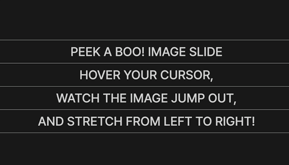

# peek-a-boo-image-slide



Javascript 없이 요소 Hover시 이미지가 정해진 비율을 가지고 좌우로 넓어지는 애니메이션입니다.

📌 DEMO
https://eveneul.github.io/peek-a-boo-image-slide

💻 기술 스택: HTML, CSS

📄 폴더 구조

```
└── peek-a-boo-image-slide/
    ├── assets/
    ├── index.html
    └── style.css
```

## 마크업 구성

```html
<main class="container">
	<ul class="list">
		<li class="item">
			<span>PEEK A BOO!</span>
			<div class="image">
				
			</div>
			<span>Image Slide</span>
		</li>
	</ul>
</main>
```

`.item` 클래스를 가진 태그 안에 텍스트와 텍스트 사이 이미지를 넣었습니다.

## CSS Style

```css
:root {
	--size: clamp(14px, calc(64 / 1920 * 100vw), 64px);
	--margin: calc(8 / 1920 * 100vw);
}
```

`--size`는 `span`으로 감싼 텍스트의 `font-size`와 이미지의 `height`와도 연관이 있으므로 `root`의 전역 변수로 설정했습니다.

`--margin`은 텍스트와 이미지 사이 `margin`값을 `calc`으로 계산하여 넣었습니다.

```css
.item .image {
	position: relative;
	width: 100%;
	max-width: 0;
	height: var(--size);
	aspect-ratio: 3 / 2;
	overflow: hidden;
	transition: max-width 0.4s cubic-bezier(0.23, 1, 0.32, 1);
	object-fit: cover;
}

.item .image img {
	position: absolute;
	top: 50%;
	left: 50%;
	transform: translate(-50%, -50%);
	width: calc(var(--size) * 3 / 2);
	height: var(--size);
	object-fit: cover;
}

.item:hover .image {
	max-width: calc(var(--size) * 3 / 2);
}
```

우선 `img` 태그를 감싼 요소(`div`)에게 `position: relative` 속성과 `width`, `max-width`, `height`, `aspect-ratio`를 주어 이미지 사이즈 계산을 해 주고, `transition`으로 이미지가 자연스럽게 애니메이션되며 커지도록 했습니다.

또, `img` 태그에게는 `position: absolute`로 상위 태그의 정가운데에 오도록 했고, 상위 태그가 늘어나면서 이미지 또한 같이 늘어나지 않게 `width`와 `height`를 같은 값으로 설정했습니다.
